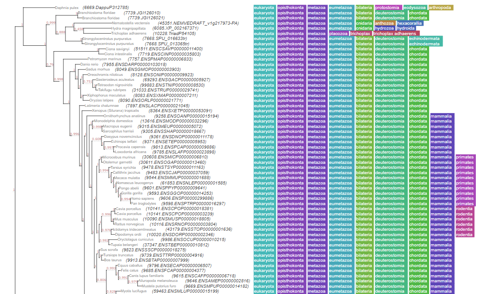

# Drosophila melanogaster Database

Bioinformatics database of drosophila

## Install

### Requirements

* Linux or Mac and Ruby (≥ 1.8.7; preferably ≥ 2.0)
* NCBI BLAST+ (2.2.31+) 
* SequenceServer
* Java 11
* NPM

```
sudo apt-get install openjdk-11-jdk-headless
sudo apt-get install ruby
sudo apt-get install ruby-dev
sudo apt-get install build-essential
sudo apt-get install ncbi-blast+
sudo gem install sequenceserver
sudo apt install npm
```

## Usage

### Sequence Server

Enter the ```sequenceserver``` folder

```
cd sequenceserver
```

Extract data in the first use

```
make get_data
```

Run the server

```
make run_server &
```


### JBrowser

Enter the ```jbrowse2``` folder

```
cd jbrowse2
```

Extract data in the first use

```
make get_data
```

Run the server

```
make run_server &
```

### Phylogenetic Tree


### Java webapp


Run the ```.jar``` file

```
java -jar BioinfoTool-0.0.1-SNAPSHOT.jar
```

Open the link [http://localhost:8080/](http://localhost:8080/)
